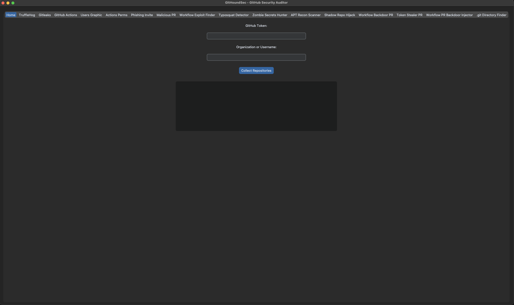

# GitHoundSec

**GitHoundSec** is an advanced offensive security toolkit for auditing GitHub organizations, repositories, and developer activity. It offers modules for secrets detection, workflow abuse, access enumeration, attack simulation, and APT-style reconnaissance.

</br>

## 🚀 Features

- **Secrets Scanning:**

  - TruffleHog & Gitleaks support
  - Organization-wide or repo-specific
  - Support for external config files and tokens

- **GitHub Actions Auditing:**

  - Detect dangerous patterns and overly permissive workflows
  - Auto-analysis and reporting

- **Offensive Modules:**

  - Malicious PR simulation
  - Workflow backdoors (direct and via PR)
  - GitHub Token theft via CI
  - Phishing invitation generator
  - Typosquatting repo finder
  - Shadow repo hijack scanner

- **APT Recon Tools:**

  - Contributor graph analysis
  - GitHub apps & actions permissions scanner
  - Developer fingerprinting

- **.git Directory Finder:**

  - Find subdomains exposing `.git/config`

- **User-Friendly Interface:**
  - Built with `customtkinter`
  - Interactive tabs for each module
  - Output terminal and logs per action

</br>

## 🧠 Requirements

- Python 3.10+
- `customtkinter`
- `requests`, `subprocess`
- External binaries (optional):
  - `subfinder` (for subdomain enumeration)
  - `trufflehog`, `gitleaks`, `git`

</br>

## ⚙️ Setup

```bash
git clone https://github.com/YourOrg/GitHoundSec.git
cd GitHoundSec
pip install -r requirements.txt
python3 main.py
```

#### or via uv (recommended)

```zsh
git clone 'git@github.com:CyberSecurityUP/GitHoundSec.git'
cd GitHoundSec
uv venv
uv sync
uv run main.py
```

#### or via docker & xhost 

- Allow docker to access your X server:

  ```zsh
  xhost +local:docker
  ```

- Run docker container:
  ```zsh
  docker run -it --rm \
    -e DISPLAY=$DISPLAY \
    -v /tmp/.X11-unix:/tmp/.X11-unix \
    githoundsec
  ```

> Note: This docker setup is primarily for Linux systems using X11. For macOS and Windows, additional configuration is required to enable GUI applications from Docker containers.

> Note: for MacOS users, you can use `xquartz` to run GUI applications from Docker containers. Install `xquartz` and [follow the instructions](https://gist.github.com/roaldnefs/fe9f36b0e8cf2890af14572c083b516c) to set up X11 forwarding.

The following ui should appear:

  

</br>

## 🛠️ Known Issues

### Tkinter & Pyenv issues in MacOS

> tkinter is a Python wrapper around Tcl/Tk GUI toolkit. On macOS, Tk is NOT bundled by default when building Python manually (like with pyenv), unless you tell it where to find it.

> Homebrew installs its own tcl-tk because the macOS system one is too old or incomplete.

#### Solution:

- Uninstall your current Python version from pyenv:

  ```bash
  pyenv uninstall <your_python_version>
  ```

- Set proper environment variables:

  ```bash
  export LDFLAGS="-L/opt/homebrew/opt/tcl-tk/lib"
  export CPPFLAGS="-I/opt/homebrew/opt/tcl-tk/include"
  export PKG_CONFIG_PATH="/opt/homebrew/opt/tcl-tk/lib/pkgconfig"
  export PATH="/opt/homebrew/opt/tcl-tk/bin:$PATH"
  ```

- Reinstall Python:

  ```zsh
  pyenv install <your_python_version>
  pyenv local <your_python_version>
  ```

- if you got local venv remove it, and create a new one:

  ```bash
  rm -rf .venv
  uv venv
  uv sync
  ```

- Run the app:
  ```bash
  uv run main.py
  ```

</br>

## 📦 Directory Structure

```
GitHoundSec/
├── backend/                  # Core logic for each module
├── frontend/                 # GUI using customtkinter
├── outputs/                  # Reports and results
├── temp_repos/              # Cloned repositories for analysis
└── main.py                   # Entry point
```

</br>

## 📌 Legal Disclaimer

This project is intended for educational and authorized security testing only. Unauthorized usage against systems you do not own or have explicit permission to test is illegal.

</br>

## 🧠 Author

Created by **Joas Antonio dos Santos**

</br>

## 🤝 Contributors

- [Mo Eltahir](https://github.com/MoElaSec)

</br>

## 🔗 License

MIT License
